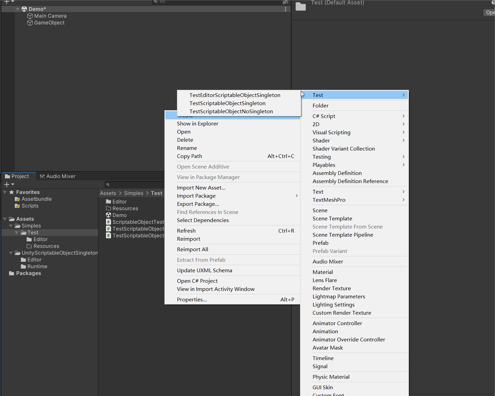

# Unity ScriptableObjectSingleton


## 说明

### unity中的ScriptableSingleton

unity中存在一个[ScriptableSingleton<T0>](https://docs.unity3d.com/2020.1/Documentation/ScriptReference/ScriptableSingleton_1.html)

但是他有点难用

* hideflag 为 dontsave
* 并不会监听创建时是否已存在
* ....

### 如何使用

* 如果是Editor的`ScriptableObject`可直接继承`ScriptableObjectSingletonEditor`使用,(也可以不继承,但是`必须要实现ISingletion接口`)
* 如果是Runtime的`ScriptableObject`需要实现`ISingletion`接口

示例:

```c#
using System.Collections;
using UnityEngine;
using UnityScriptableObjectSingleton.Editor;
using UnityScriptableObjectSingleton.Runtime;
/// <summary>
/// ____DESC:      
/// </summary>
[CreateAssetMenu(fileName = "TestScriptableObjectSingleton", menuName = "Test/TestScriptableObjectSingleton", order = 0)]
public class TestScriptableObjectSingleton : ScriptableObject, ISingletion
{
    //手动实现Instance
    private static TestScriptableObjectSingleton _instance;
    public static TestScriptableObjectSingleton Instance
    {
        get
        {
            if (_instance == null)
            {
                _instance = Resources.Load<TestScriptableObjectSingleton>("TestScriptableObjectSingleton");
                if (_instance == null)
                {
                    Debug.LogError("Can't find the instance of TestScriptableObjectSingleton");
                }
            }
            return _instance;
        }
    }
    public int value;
}
```

```c#
using System.Collections;
using UnityEngine;
using UnityScriptableObjectSingleton.Editor;
/// <summary>
/// ____DESC:      
/// </summary>
[CreateAssetMenu(fileName = "TestEditorScriptableObjectSingleton", menuName = "Test/TestEditorScriptableObjectSingleton", order = 0)]

public class TestEditorScriptableObjectSingleton : ScriptableObjectSingletonEditor<TestEditorScriptableObjectSingleton>
{
    public int value;
}
```

具体可查看`Samples`里面的示例
